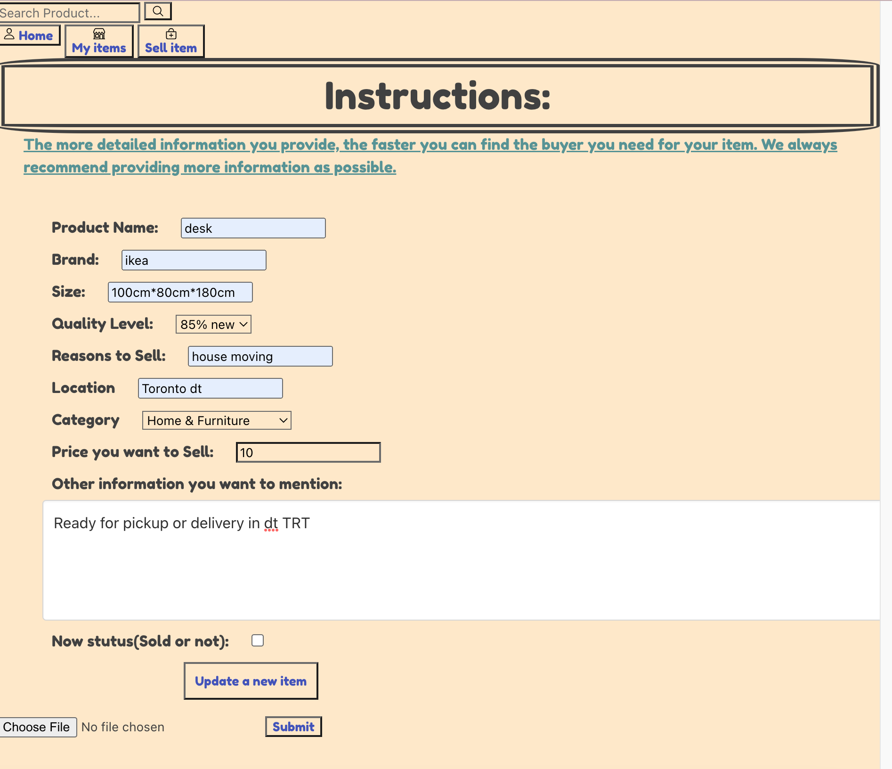
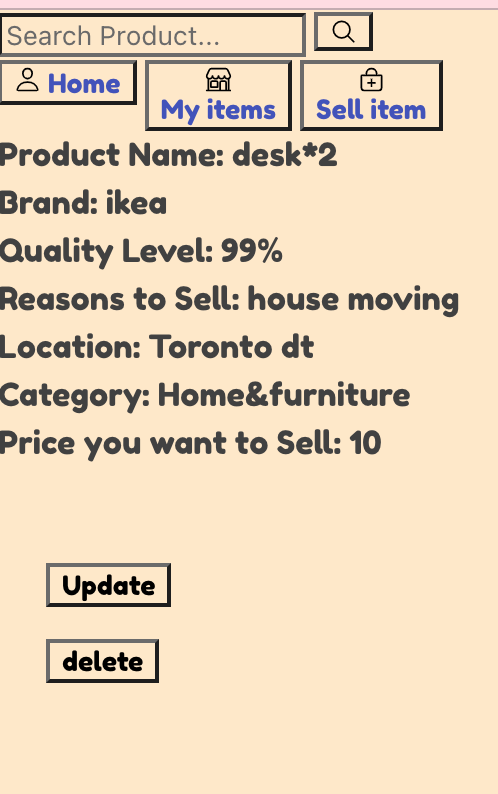

# Project 2: Node/Express/MongoDB Full-stack CRUD Application

 

## Introduction

Tradie is a Marketplace: Second-hand shopping-site.

We could leave our information or items want to sell in Tradie, waiting for someone to buy.

 

## Tech Stack

- <b>Node</b>
- <b>MongoDB</b>
- <b>Express</b>
- <b>OAuth authentication</b>

## Getting Started

Lets get started!
Access the app through the link below:
### [Live Link](https://tradie-project2.herokuapp.com/)

## Features

### Home Page

### Create New Post Template

### Google OAuth:

### Edit/Update & Delete Template

### Post details:
Our App users can edit, update, and delete their own items. Users can make a comment, delete their own comments.

## Code Examples

## Future enhancements

1. Upload images for each item
2. Look more pretty and professional
3. Have a profile for each user and can connect each other

## Project Tools

### [Trello Board](https://trello.com/b/d0aqn5Cm/tradie)
### [Wireframes](https://www.figma.com/file/LbIoLUdKPyDHSdoroZzZkW/Tradie?node-id=0%3A1)
### [ERD](https://lucid.app/lucidchart/80c2017b-ca10-4b90-bc2c-66392deb7b64/edit?page=0_0#)

